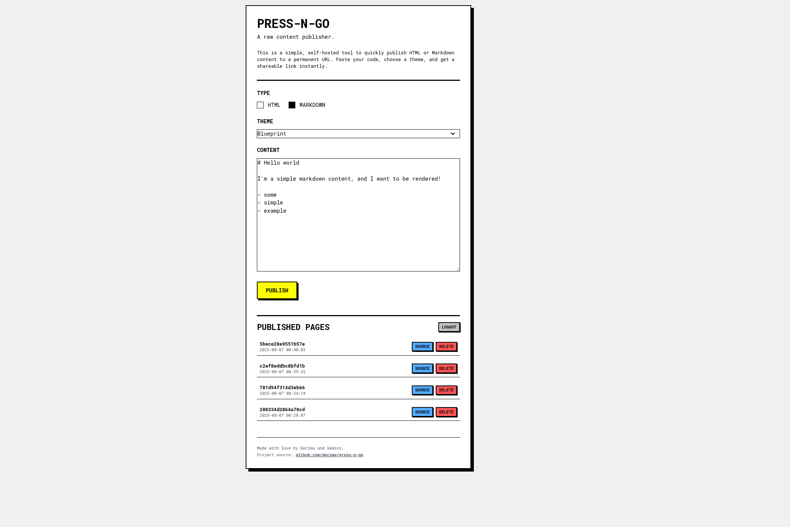
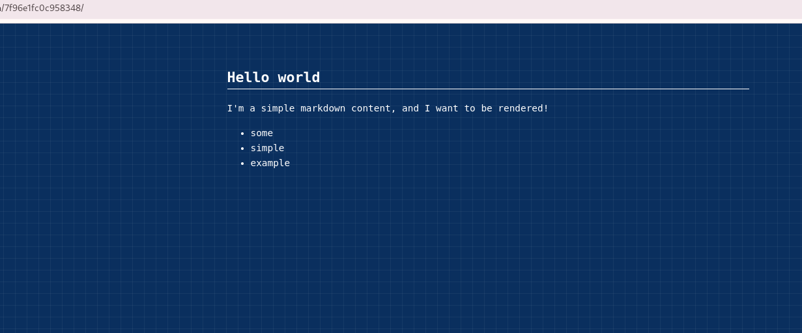

Press-n-Go
=====================

Press-n-Go is a simple, self-hosted tool to quickly publish HTML or Markdown content to a permanent URL. It's designed
to be a fast and lightweight solution for when you need to share a snippet, a document, or a simple webpage without the
hassle of a full-blown CMS.

The interface is a brutalist-inspired, single-page application where you can paste your content, choose a theme for
Markdown, and instantly get a shareable link.

Features
-------------------

- Instant Publishing: Paste HTML or Markdown and get a live URL in seconds.
- Markdown Theming: Choose from several built-in themes to style your Markdown content.
- Page Management: View a list of all published pages, with creation dates and the ability to delete them or download
  the original source.
- Secure Admin Panel: The publishing interface is protected by a username and password.
- Optional Authentication: If no credentials are set, the panel becomes publicly accessible.
- Dockerized: Comes with a docker-compose.yml for easy, one-command setup.

Requirements
--------------------
To run this project, you will need:

- Docker
- Docker Compose

Quickstart with Docker Compose
--------------------------------

This is the easiest way to get the project running locally.

Clone the repository:

```shell
git clone https://github.com/decima/press-n-go.git
cd press-n-go
```

### Configure Credentials (Optional):

Open the compose.yaml file and set the `PNG_USERNAME` and `PNG_PASSWORD` environment variables. If you leave them blank,
authentication will be disabled.

environment:

- `PNG_USERNAME=admin`
- `PNG_PASSWORD=password`
- `PNG_PORT=8080`

### Run with Docker Compose:

docker-compose up --build

Access the Publisher:
Open your browser and navigate to http://localhost:8080/.

Some screenshots !
-----------------------------



----------------------------------------

Made with love by Decima and mostly Gemini, I was just here to ensure there are no issues.